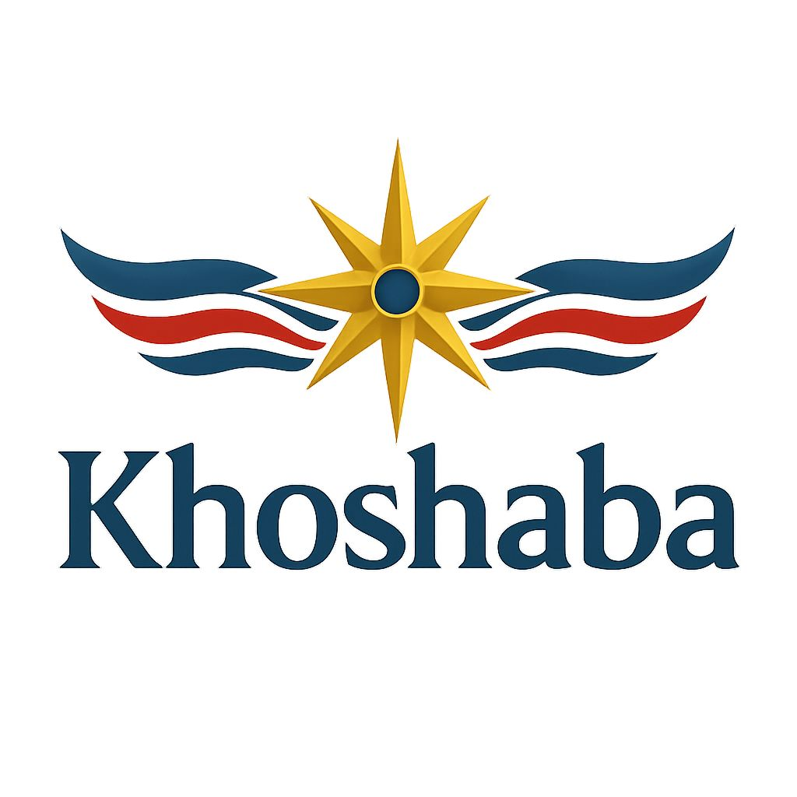

# Khoshaba Odeesho – Data Analyst

🌆 Melbourne
... 

---

🎯 **Aspiring Data Analyst** based in Melbourne, with a strong background in Mathematics and real-world experience in the hospitality industry. Passionate about turning raw data into actionable insights through Python, Tableau, and Power BI.

---

## 🧠 About Me

Former Duty Manager in the hotel industry, now transitioning into data analytics.  
I bring operational thinking, business intuition, and technical skills to solve real problems.  
I’m actively building a portfolio with real-world projects in travel, retail, pricing, and sports — aiming to break into the Australian data market.

---

## 🛠️ Tools & Skills 

- **Languages & Libraries:** Python (Pandas, NumPy, Seaborn, Matplotlib), SQL  
- **Data Visualization:** Tableau, Power BI, Excel  
- **Other Skills:** Data Cleaning, Dashboard Design, Exploratory Data Analysis (EDA), Machine Learning  
- **Soft Skills:** Communication, Teamwork, Critical Thinking

---

## 📚 Certifications

- 🧠 **IBM Watson Studio** – Data analysis & ML workflows  
- 🐍 **Badge of Python Coding – Kaggle**  
- 📊 **Data Science Essentials with Python – Cisco Networking Academy**  
- 📈 **Data Analytics Essentials – Cisco**  
- 🔍 **Data Science Course – Cisco**  
- 🔐 **Cybersecurity Course – Cisco**

---

## 🚀 Featured Projects

| Project | Description | Tools |
|--------|-------------|-------|
| [🧠 Churn Prediction API (MLOps)](https://github.com/Assyrian91/churn-mlops-pipeline) | End-to-end machine learning project with API deployment using FastAPI and Streamlit. | Python, FastAPI, Streamlit, Scikit-Learn |
| [✈️ Airline Delay & Cancellation](https://github.com/Assyrian91/airline_delay_analysis) | Analyzed 10 years of flight delay data with dashboard creation. | Python, Tableau |
| [🚗 Uber Pricing Strategy](https://github.com/Assyrian91/PowerBI-Uber-Dashboard) | Built a pricing model and visualized ride data. | Python, Power BI |
| [🏨 Hotel Booking Analysis](https://github.com/Assyrian91/Hotel-booking-analysis) | Explored customer booking trends and cancellations. | Python, Power BI |
| [🛒 Retail Price Optimization](https://github.com/Assyrian91/online-retail-Pricing-analysis) | Analyzed sales data to improve pricing strategy. | Python, Tableau |
| [⚽ Premier League Dashboard](https://github.com/Assyrian91/Premier-League_1991-2020) | Advanced dashboard for EPL player stats. | Python, Tableau |
| [🚙 Car Price Prediction (ML)](https://github.com/Assyrian91/Car-Price-Prediction-ML) | ML model to predict car prices. | Python, Scikit-Learn |

---

## 📫 Let’s Connect

- 💼 [LinkedIn](http://linkedin.com/in/khoshaba-odeesho-17b5b92aa)  
- 💻 [GitHub](https://github.com/Assyrian91)  
- 📧 Email: khoshabayalda91@gmail.com  

---

> “Melbourne is where I live, but data is where I thrive.”
